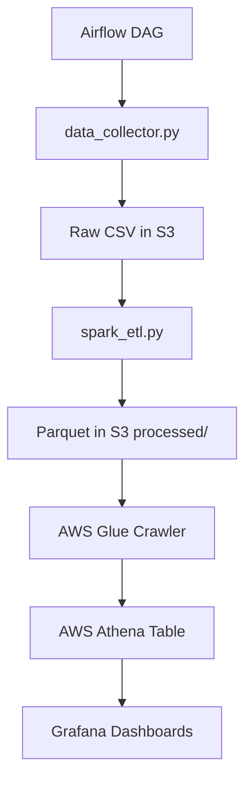

# 🔗 Spark Crypto Pipeline

A complete end-to-end data engineering project that collects, processes, stores, and visualizes cryptocurrency price data from Binance using Spark, Airflow, AWS S3, Athena, Glue, and Grafana.


## 📋 Table of Contents
- [Overview](#-overview)
- [Tools & Technologies](#-tools--technologies)
- [Architecture](#-architecture)
- [Pipeline Flow](#-pipeline-flow)
- [Project Setup](#-project-setup)
  - [Prerequisites](#prerequisites)
  - [Installation](#installation)
  - [AWS Resource Configuration](#aws-resource-configuration)
  - [Grafana Dashboard Setup](#grafana-dashboard-setup)
- [Contributing](#-contributing)

## 🔹 Overview

This project builds a scalable and automated data pipeline that:

- Collects live crypto price data from the Binance API every hour
- Processes the data using Apache Spark (calculating moving averages and percent change)
- Stores raw and processed data in AWS S3
- Creates a queryable data catalog using AWS Glue and Athena
- Visualizes trends, volatility, and alerts using Grafana dashboards

## 🔧 Tools & Technologies

| Tool/Service     | Purpose                              |
|------------------|--------------------------------------|
| Docker           | Containerized environment setup      |
| Apache Airflow   | Workflow orchestration               |
| Apache Spark     | Data transformation and computation  |
| AWS S3           | Cloud data storage (raw and processed)|
| AWS Glue         | Schema crawler and catalog registration|
| AWS Athena       | Query interface for S3 data          |
| Grafana          | Dashboard and alert visualization    |
| Python           | Data collection and script logic     |

## 📊 Architecture

The pipeline architecture follows these key components and data flow:



## 🚀 Pipeline Flow

### ✈️ 1. Data Collection (data_collector.py)
- Fetches live prices from Binance REST API
- Converts to pandas.DataFrame, adds UTC timestamp
- Stores raw .csv directly to S3 via boto3.put_object()

### ⚙️ 2. Data Processing (spark_etl.py)
- Loads raw CSVs from S3 using Spark
- Filters valid USDT-based symbols
- Cleans data, calculates:
  - Moving average (5-period window)
  - Previous price (lag)
  - Price change percentage
- Writes processed data to S3 as partitioned Parquet (partitionBy('date'))

### ⏳ 3. Orchestration (Airflow DAG)
- One DAG (crypto_pipeline_dag.py) scheduled hourly:
  - Task 1: collect_binance_data ➔ PythonOperator
  - Task 2: process_with_spark ➔ SparkSubmitOperator

### ☁️ 4. Cloud Storage & Query
- S3: raw/ and processed/ folders
- Glue: crawler detects schema & partitions in processed/
- Athena: reads Parquet with external table and executes SQL

### 🔍 5. Visualization (Grafana)
- Uses Athena plugin as data source
- Dashboards built with:
  - Stat of variation
  - Stat of max price and min price
  - Gauge of current price
  - Bar chart of volatility
  - Time series of price and moving average
- Variables: $symbol filter, $__timeFilter(timestamp) macro

  ```sql
   SELECT DISTINCT symbol FROM processed WHERE price > 0
   ```

## 🔌 Project Setup

### Prerequisites

Before beginning, make sure you have:

- **Docker & Docker Compose**: For containerization
- **AWS Account**: With permissions to create S3 buckets, IAM roles, Glue crawlers, and Athena databases
- **Git**: For cloning the repository
- Approximately 4GB of free RAM for running the containers

### Installation

1. **Clone the repository**

```bash
git clone https://github.com/YOUR_USERNAME/spark-crypto-pipeline.git
cd spark-crypto-pipeline
```

2. **Setup environment**

For Linux/Mac users:
```bash
chmod +x setup.sh
./setup.sh
```

For Windows users:
```powershell
.\setup.ps1
```

The setup script will:
- Check for Docker and Docker Compose
- Create a `.env` file
- Create required directories
- Fix permissions (Linux only)
- Start the Docker containers

3. **Configure environment variables**

Edit the `.env` file with your AWS credentials and settings:

```
AWS_ACCESS_KEY_ID=your_aws_access_key_id
AWS_SECRET_ACCESS_KEY=your_aws_secret_access_key
AWS_DEFAULT_REGION=your_aws_region
S3_BUCKET_NAME=your_s3_bucket_name
```

4. **Start the services**

If you didn't use the setup script, start the services manually:

```bash
cd airflow
docker-compose up --build -d
```

5. **Access Airflow UI**

Open your browser and navigate to http://localhost:8080

Default credentials:
- Username: `airflow`
- Password: `airflow`


You should see the DAG list with the `crypto_pipeline` DAG


#### 🔗 Configuring the Spark Connection in Airflow

After logging into Airflow, follow these steps to set up the connection to your Spark cluster:

1. In the top menu, click on **Admin** > **Connections**.
2. Click the **+ (Add Connection)** button in the top right corner.
3. Fill in the fields as follows:

| Field           | Value              |
| --------------- | ------------------ |
| Connection ID   | spark_default      |
| Connection Type | Spark              |
| Host            | spark://spark:7077 |

4. Leave the other fields blank (unless you have custom requirements).
5. Click **Save**.

> **Note:**
> The Connection ID must be exactly `spark_default`, as this is the default name used by the `SparkSubmitOperator` in Airflow.

Now Airflow is ready to orchestrate Spark jobs in your pipeline!

### AWS Resource Configuration

#### 1. Create an S3 Bucket

1. Go to the [Amazon S3 Console](https://s3.console.aws.amazon.com/)
2. Click "Create bucket"
3. Enter a globally unique bucket name (e.g., `your-username-crypto-pipeline`)
4. Choose an AWS Region close to your location
5. Keep the default settings or customize as needed
6. Click "Create bucket"


#### 2. Configure Bucket Access

1. Create an IAM user or role with the following permissions:
   - `s3:PutObject`
   - `s3:GetObject`
   - `s3:ListBucket`
   - `s3:DeleteObject` (optional)

2. Create an IAM policy (if not using an existing one):
   ```json
   {
       "Version": "2012-10-17",
       "Statement": [
           {
               "Effect": "Allow",
               "Action": [
                   "s3:PutObject",
                   "s3:GetObject",
                   "s3:ListBucket",
                   "s3:DeleteObject"
               ],
               "Resource": [
                   "arn:aws:s3:::your-bucket-name",
                   "arn:aws:s3:::your-bucket-name/*"
               ]
           }
       ]
   }
   ```

3. Generate access keys for your IAM user and add them to your `.env` file:
   ```
   AWS_ACCESS_KEY_ID=your_access_key
   AWS_SECRET_ACCESS_KEY=your_secret_key
   AWS_DEFAULT_REGION=your_region
   S3_BUCKET_NAME=your_bucket_name
   ```

#### 3. Set Up AWS Glue Crawler

1. Go to the [AWS Glue Console](https://console.aws.amazon.com/glue/)
2. Navigate to "Data Catalog" -> "Crawlers" and click "Create crawler"
3. Enter a name for your crawler (e.g., `crypto-crawler`)
4. Select "S3" as the data source
5. Include the path to your processed data: `s3://your-bucket-name/processed/`
6. Create a new IAM role or use an existing one with Glue permissions
7. Choose an existing database or create a new one (e.g., `dbcrypto`)
8. Configure the crawler schedule (e.g., run every hour)
9. Review and create the crawler

#### 4. Run the Glue Crawler

1. Return to the Crawlers section in the AWS Glue Console
2. Select your crawler and click "Run"
3. Wait for the crawler to complete (this might take a few minutes)
4. Once completed, the crawler will have created a table in your Glue Data Catalog


#### 5. Set Up AWS Athena

1. Go to the [AWS Athena Console](https://console.aws.amazon.com/athena/)
2. Configure a query result location: `s3://your-bucket-name/athena-results/`
3. In the query editor, you should now see your Glue database and the table created by the crawler
4. Run a test query to verify the setup:
   ```sql
   SELECT * FROM "dbcrypto"."processed" limit 10;
   ```


#### 6. IAM Permissions for Glue and Athena

Ensure your IAM user or role has the following additional permissions:

```json
{
    "Version": "2012-10-17",
    "Statement": [
        {
            "Effect": "Allow",
            "Action": [
                "glue:GetCrawler",
                "glue:StartCrawler",
                "glue:GetDatabase",
                "glue:GetTable",
                "glue:GetPartitions",
                "athena:StartQueryExecution",
                "athena:GetQueryExecution",
                "athena:GetQueryResults"
            ],
            "Resource": "*"
        }
    ]
}
```

### Grafana Dashboard Setup

#### 1. Access Grafana Cloud

Instead of running Grafana locally, this project uses **Grafana Cloud** for dashboarding and visualization. You can access your Grafana Cloud instance at:

- https://user.grafana.net

Log in with your Grafana Cloud credentials. If you don't have an account, you can sign up for a free Grafana Cloud account at [Grafana Cloud Signup](https://grafana.com/auth/sign-in).

#### 2. Install the AWS Athena Data Source Plugin (if not already installed)

1. In the left sidebar, click on the **Connections** and **Add new connection**.
2. Search for "Athena".
3. Click on the AWS Athena plugin.
4. If not already installed, click **Install** and follow the instructions.


#### 3. Configure the Athena Data Source

1. In the left sidebar, click on **Connections** and **Data Sources**.
2. Click **Add new data source**.
3. Search for and select **AWS Athena**.
4. Fill in the following settings:
   - **Name**: `Crypto Data`
   - **Auth Provider**: `Access & secret key` (or `AWS SDK Default` if using IAM roles)
   - **Access Key ID**: Your AWS access key
   - **Secret Access Key**: Your AWS secret key
   - **Default Region**: Your AWS region (e.g., `us-east-2`)
   - **Catalog**: `AwsDataCatalog` (default AWS Glue catalog)
   - **Database**: The database name you created in Glue (e.g., `dbcrypto`)
   - **Workgroup**: `primary` (or your custom workgroup)
   - **Output Location**: `s3://your-bucket-name/athena-results/`
5. Click **Save & Test** to verify the connection.


#### 4. Create Dashboards

Now you can create dashboards and panels in Grafana Cloud just as you would in a local Grafana instance. Use the Athena data source for your queries and visualizations.

- For example, to create a price trends dashboard:
  1. Click on the left sidebar and select **Dashboard**
  2. Click **New** and **New dashboard**
  3. In the query editor, select the "Athena" data source and enter your SQL query
  4. Configure the visualization as desired
  5. Save the dashboard

Refer to the rest of the documentation for example queries and dashboard ideas.

> **Note:** All dashboard features, alerts, and variables described in this documentation can be created and managed directly in your Grafana Cloud workspace.

##### Volatility Dashboard

1. Create a new dashboard
2. Add a panel
3. In the query editor:
   ```sql
    SELECT 
        symbol, 
        STDDEV(price_change_pct) AS volatility 
    FROM processed 
    WHERE $__timeFilter(timestamp)
    GROUP BY symbol 
    ORDER BY volatility DESC 
    LIMIT 10;
   ```
4. Configure visualization:
   - Select "Bar chart" visualization
   - X-field: `symbol`
   - Y-field: `volatility`
5. Save the panel as "Top 10 Most Volatile Cryptocurrencies"
6. Save the dashboard as "Crypto Volatility Dashboard"

##### Summary Dashboard

1. Create a new dashboard
2. Add multiple panels:
   - Current Price (Gauge panel)
   - Max price (Stat panel)
   - Min price (Stat panel)
   - Volatility (Bar chart)
   - Price and moving average (Time series)

   For the Current Price Panel Example:
   ```sql
    WITH ranked AS (
      SELECT 
        price,
        ROW_NUMBER() OVER (PARTITION BY symbol ORDER BY timestamp DESC) AS rn
      FROM processed
      WHERE symbol = '$symbol' 
        AND $__timeFilter(timestamp)
    )
    SELECT 
      MAX(price) AS max_price, 
      MIN(price) AS min_price, 
      (SELECT price FROM ranked WHERE rn = 1) AS current_price
    FROM processed 
    WHERE symbol = '$symbol' 
      AND $__timeFilter(timestamp);
   ```

## 🛠 Contributing

Contributions are welcome! Please feel free to submit a Pull Request.

1. Fork the repository
2. Create a new branch: `git checkout -b feature/your-feature-name`
3. Make your changes
4. Commit your changes: `git commit -m 'Add some feature'`
5. Push to the branch: `git push origin feature/your-feature-name`
6. Submit a pull request

## ⚠️ Cost Warning

This project uses AWS services that may incur costs:
- S3 storage and requests
- Glue crawlers and Data Catalog
- Athena queries (charged per TB scanned)

Be sure to monitor your AWS costs and consider setting up budget alerts through AWS Cost Explorer.
